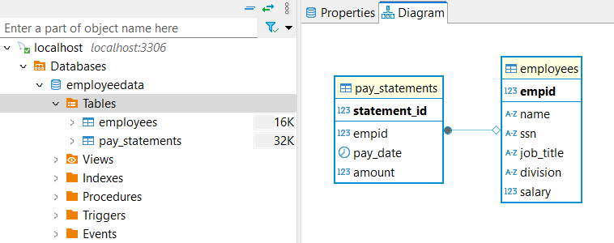

# CSC3350 Final Project

Minimal Java console application to manage employee data with a MySQL database.

---

## How to Run Locally

### 1. Install Requirements

- Java 17+ installed
- MySQL Server running locally
- MySQL JDBC Connector JAR (already included in `lib/`)
- (Optional but recommended) DBeaver for easier database management

---

### 2. Set Up the Database

#### Option A: Using Provided SQL Script

1. Open **DBeaver** (or MySQL CLI, or MySQL Workbench).
2. Connect to your local MySQL server.
3. Create the database manually by running:

```sql
CREATE DATABASE IF NOT EXISTS employeeData;
USE employeeData;

CREATE TABLE employees (
    empid INT PRIMARY KEY,
    name VARCHAR(100),
    ssn VARCHAR(20),
    job_title VARCHAR(100),
    division VARCHAR(100),
    salary DOUBLE
);

CREATE TABLE pay_statements (
    statement_id INT PRIMARY KEY AUTO_INCREMENT,
    empid INT,
    pay_date DATE,
    amount DOUBLE,
    FOREIGN KEY (empid) REFERENCES employees(empid)
);
```

You should now see the database `employeeData` with two tables: `employees`, `pay_statements`.




---

### 3. Configure Database Credentials

In `src/MainApp.java`, make sure your connection string matches your local MySQL credentials:

```java
Connection conn = DriverManager.getConnection(
    "jdbc:mysql://localhost:3306/employeeData",
    "root",        // your MySQL username
    "yourpassword" // your MySQL password
);
```

Update the `"root"` and `"yourpassword"` fields as necessary.

---

### 4. Compile the Project

In the project root (`csc3350_SD_Project/`), open a terminal or PowerShell and run:

```bash
javac -cp ".;lib/mysql-connector-j-9.3.0.jar" -d bin src/MainApp.java src/dao/*.java src/interfaces/*.java src/models/*.java src/reports/*.java src/ui/*.java
```

This compiles all `.java` files into the `bin/` folder.

**Note**: Make sure the `bin/` and `lib/` folders already exist.

---

### 5. Run the Program

After compiling, run the program:

```bash
java -cp ".;bin;lib/mysql-connector-j-9.3.0.jar" MainApp
```

You should see the Employee Management System menu:

```
=== Employee Management System ===
1. Insert New Employee
2. Search Employee
3. Update Employee
4. Update Salaries by Range
5. Generate Reports
6. Exit
Enter your choice:
```

You can now fully use the application!

---

## Running Unit Tests

JUnit test file is located at:

```plaintext
src/test/MySQLEmployeeDAOTest.java
```

- You can use JUnit 5 to run the tests.
- Make sure your `test/` classes have access to the JDBC connector (`lib/mysql-connector-j-9.3.0.jar`) during testing.

---

# Contributors

- Tanaka Makuvaza
- William Shay
- Syed Shoyeb
- Victor Googe
- Shan Patel